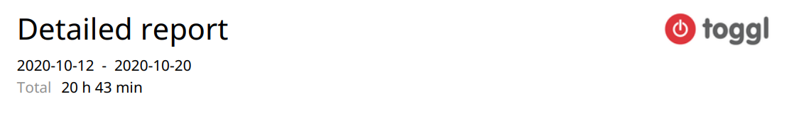

# DevOps Coding Test

## Outcome


Go to [progress](./PROGRESS.md) logs for my entries throughout the work done.

### Time spent

I've used Toggl to record my efforts as I would with any other job. Completion took about ~20 working hours, which equals ~4 business working days.



### Deployment

We can run the following commands on Linux to get it running.

#### Prerequisites

- AWS credentials with an access key
- Terraform installed
- AWS CLI installed
- *Money*

#### Let's do it

```bash
# Let's use Homebrew to install packages (KISS)
brew install awscli terraform

# Add the access key ID, secret & region
aws configure

# Use Terraform to deploy the stack
make deploy

# Teardown the stack
# WARNING! Make sure there's no running ECS tasks before executing this
make destroy
```

Ta-da! You should have the ECS stack mentioned in this challenge.

### Development

I've containerised the application with Docker along with some quality of life tooling such as Docker Compose and Make.

#### Prerequisites

- Docker installed
- Docker Compose installed
- Make installed
- *Some memory*

#### Let's do it

```bash
# Spin up the test application locally
make up

# Toubleshoot the test application via exec'ing into the container
make exec

# Sync any changes
make sync

# Teardown
make down
```

## What I could of had if there was more time

- Use GitHub Actions to deploy this stack
- Encrypted Terraform S3 backend
- Use a S3 bucket to store Terraform state
- Separate IAM user to deploy the stack instead of my own credentials
- Rotating secrets using SecretsManager
- Grafana and Prometheus stack setup to pull metrics from the test application - perhaps integrate Thanos for reliable Prometheus metrics
- HTTPS enabled on through the Internet Gateway, Traefik or some sort of ingress controller perhaps?
- **Setup the whole thing in Kubernetes, because I fucken love Kubernetes**

## Containerisation

The first step of the test is to containerise the app located in the [test-application](test-application/) directory.

If you have indicated that you do not have experience creating Docker container images, you may skip this portion
of the test. If you would like to try anyway, please do this second. If you complete this section please
use your container image in the second portion of the test as we will do the same when testing the infrastructure
code.

### Aim

The aim of this is to demonstrate knowledge of containerising an app. In this case it is a Java application
with Gradle. It has been tested with JDK 11.

See the [README](test-application/README.md) for the application as to how to build the application.

## Infrastructure Code

The second step of the test is to write infrastructure code which will deploy the container. As mentioned,
if you have created your own container image, please use it for this section. We will build from the Dockerfile you
provide.

We don't expect you to spend a significant amount of time on this. Take the time you think is reasonable and if you
need to take a shortcut due to time, please indicate this and what you would include if you had more time.

### Aim

Produce AWS Cloudformation infrastructure code which orchestrates deploying a containerised web API and related components.

The deployed infrastructure should demonstrate a knowledge of how to configure:

- ECS
- Load balancing
- RDS (Postgres in this case)
- VPC networking (security groups, etc.)
- Secrets
- IAM

This can be multiple stacks if you feel it is appropriate. You can use a self-signed certificate for testing.

You should be able to access the endpoints described in the [application README](test-application/README.md) after
deployment.

A pre-built container image is available here which you may use if you have not created your own (it is public):

`scottg88/test-application:latest`

This image, in addition to the configuration options in the [application README](test-application/README.md),
accepts an extra environment variable that understands the format of an RDS SecretsManager secret to configure
the application's d:

`SM_SQL_CONN_SECRET` - ARN or friendly name of the secret.

## Submitting

Please create a GitHub repository and send through the link. You may make this private, if so please
add [@scottg88](https://github.com/scottg88) and [@jcaputo79](https://github.com/jcaputo79) as collaborators.
 
If you have any questions throughout this process you may reach out to us via the details you were provided.
